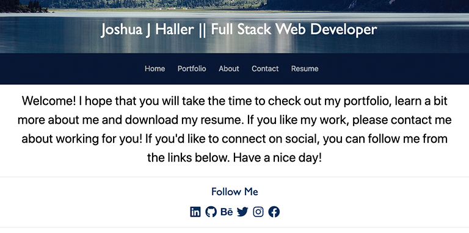

# [Joshua Haller Web Dev Portfolio](https://jjh-webdev-portfolio.herokuapp.com)

    
    
    
    

    
    

## Application Descrition

This is my React Web Dev portfolio. I plan to make more improvements as I get better at React. My next step is to host this on my own domain, which I already own

## Application Demo

To watch a video of the application being fully demo'd please use this link: [Application Demo](https://drive.google.com/file/d/1Tu2vPK7n7veYFZwQRP9Meg6Cwb12sT0j/view).

## Technologies Used

  
  
  
  
  

## Workflow

This project was quite frustrating. In the instructional Readme, we were told to deploy to Github pages. Our instructor mentioned that you should be depoloying at the root of your Github so that you get a nice, clean URL. This sounded great but we had been given no instructions on how to do this. Our instructor told us to name the repo in a specific way so that it'd be the root of your repo. No big deal there. The issue came when we tried to follow the deployment instructions given in our Readme. To say they were not helpful would be kind. They were terrible! So many classmates had issues with it to the point that our instructor and TAs told us to not bother deploying to Github pages and just use Heroku. The frustrating bit was this was told to us after a week of us trying to get Github pages to work. Which had happened the week before on our previous homework. Which we were eventually told to deploy to Heroku instead of Github pages.

Once that got sorted, I stashed my previous repo because it was not working. I renamed it so that I could use the root name of my Github. After installing my React app, I created components and pages based on how I understood the instructional Readme. I also removed all the unnecessary React parts that are installed. I then added some mock up text to each component and page to see if I could get them to show up as I moved around my application.

My first attempt at routing my components and apges was based on something a study group member had been doing. I got it to work but it kind of stopped working on my portfolio page. Just not dynamic enough for me and I ended up watching a YouTube video on creating a responsive React navbar. This really helped me figure out how to use Router with Switch and Route. It also made me glad I wasn't deploying to Github pages because it doesn't work there.

My next challenge was getting my portfolio to load with my cards. Initially I thought I could use a json file and reference it inside my project card that populated my portfolio page. I used a previous activity to test this and it sort of worked. I was able to get my text to show up but couldn't figure out how to get my images to show up because the activity was using public URLs for its images. I got a temporary solution by putting my photos inside my public folder but then ran into other issues. A TA turned me onto the idea of creating a photos folder and importing those photos into my projects file. He also got me to switch my json file to a js file and exporting it as a component.

That got me to be able to have images show up on my cards. Which led to my final issue on this page: getting links to show up. I wanted to have links to contributors, the live appliation and repository. I was able to easily insert a simple link from my projects.js file but I wanted to stylize it. I wanted icons inside each button to give them a nice look. Fortunately I had already learned how to use React icons in a video. I used those icons in my Footer component and I was able to transfer that usage to my Portfolio projects component. I do want to work on how the buttons are spaced but overall, I'm happy with the look.

I added a download link on my Resume page. I know that we have been told to just have the Resume button link to a download, but I really do not like doing that to the user. I feel like showing them the link and telling the user what it does is friendlier than having a button automatically download a PDF. With all the privacy and security issues on the web, I think this is a better way to get my resume out.

## Resources

[Shields.io](https://shields.io/)

[React Icons](https://react-icons.github.io/react-icons/)

[React Responsive Navbar Tutorial](https://www.youtube.com/watch?v=BHC-ll9PFe0&t=2s)

[The best way to use icons in React(with React Icons)](https://www.youtube.com/watch?v=aor9hlcODUE&t=2s)

[Screencastify](https://www.screencastify.com/)

My Study Group

- [Dan](https://github.com/DanZosh)
- [Thomas](https://github.com/Tskading)
- [Zac](https://github.com/themancalledzac)
